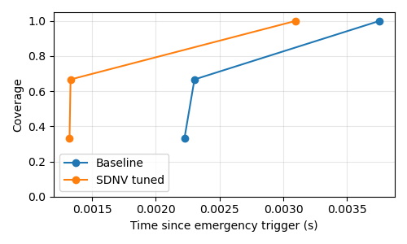
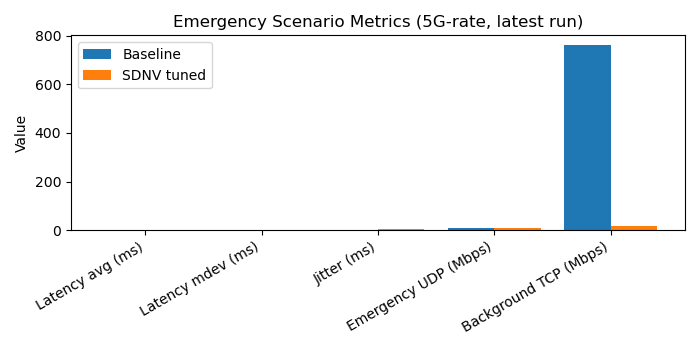

# SDNV Mininet-WiFi Testbed

This repository implements a Mininet-WiFi based testbed for experimenting with
Software-Defined Networked Vehicles (SDNV). The goal is to compare a baseline
SDN VANET architecture with a proposed architecture where the vehicle itself
participates in network control.

## Why This Testbed

The testbed was developed to provide a reproducible, lightweight environment
for SDNV experiments that can run on a single Linux host. It allows us to
compare baseline SDN behavior with a vehicle-assisted SDN policy under
controlled traffic and mobility conditions.

## Purpose

Use this testbed to:
1. Evaluate how in-vehicle policy enforcement (traffic control) impacts
   emergency and best-effort flows.
2. Measure latency, jitter, and throughput under controlled congestion.
3. Reproduce experiments for papers or course projects without needing
   physical vehicular hardware.

## How It Is Built

The testbed is a small Mininet-WiFi network plus a Ryu controller:
1. Mininet-WiFi topology with 4 stations, 2 RSU access points, 1 OVS switch,
   and 1 host (`h1`) acting as an edge/cloud service.
2. A Ryu OpenFlow 1.3 controller that implements a simple L2 learning
   switch and a high-priority rule for emergency UDP traffic (dst port 5001).
3. Vehicle-side policies implemented as `tc` scripts to shape traffic at the
   station interface.
4. Traffic generators based on `iperf` for emergency (UDP), background
   (TCP), and congestion flows.
5. Measurement scripts for latency (ping), jitter (iperf UDP), and throughput
   (iperf TCP).

## How It Works

1. Start the controller.
2. Launch the topology and connect stations to APs.
3. Apply baseline or SDNV policy on `sta1`.
4. Run emergency and background traffic, optionally with congestion.
5. Collect KPI logs and summarize results.

## Structure

```
sdnv-mininet-project/
│
├── topology/
│   └── sdnv_topology.py
│
├── controller/
│   └── sdnv_controller.py
│
├── vehicle/
│   ├── baseline_policy.sh
│   └── sdnv_policy.sh
│
├── traffic/
│   ├── emergency_flow.sh
│   ├── background_flow.sh
│   └── congestion_flows.sh
│
├── experiments/
│   ├── run_baseline.sh
│   └── run_sdnv.sh
│   └── auto_run.py
│
├── measurements/
│   ├── latency.sh
│   ├── jitter.sh
│   └── throughput.sh
│   └── parse_results.py
│   └── plot_results.py
│
├── results/
│   ├── baseline/
│   └── sdnv/
│
├── logs/
│
└── README.md
```

## Getting Started

1. Install Mininet-WiFi and dependencies on Ubuntu.
2. For manual runs, launch the controller:

   ```sh
   ryu-manager controller/sdnv_controller.py
   ```

   If your controller listens on a non-default port, set `RYU_PORT` when
   launching the topology (default is `6653`).

3. Manual run (interactive CLI):

   ```sh
   sudo bash experiments/run_baseline.sh
   # or
   sudo bash experiments/run_sdnv.sh
   ```

4. Automated run (headless-friendly, runs measurements end-to-end):

   ```sh
   sudo python3 experiments/auto_run.py --scenario baseline
   # or
   sudo python3 experiments/auto_run.py --scenario sdnv
   ```

   The automation starts iperf servers on `h1`, runs congestion flows from
   `sta2-4`, applies the policy on `sta1`, and collects latency/jitter/throughput.

5. Summarize results:

   ```sh
   python3 measurements/parse_results.py
   ```

6. Plot results:

   ```sh
   python3 measurements/plot_results.py
   ```

7. Check the `results/` directory for output and `logs/` for debug logs.

## Experiment Parameters You Can Change

Topology and mobility:
1. Station/AP positions and mobility path: `topology/sdnv_topology.py`
2. Number of stations/APs or their SSIDs and channels: `topology/sdnv_topology.py`
3. Mobility timing (start/stop and duration): `topology/sdnv_topology.py`
4. Dynamic scaling via flags or env:
   - `--num-vehicles` or `SDNV_NUM_VEHICLES`
   - `--area-size` or `SDNV_AREA_SIZE`
   - `--speed-kmh` or `SDNV_SPEED_KMH`
   - `SDNV_WIFI_MODE` (AP PHY mode)

Controller behavior:
1. Emergency traffic match and priority: `controller/sdnv_controller.py`
2. Default forwarding behavior: `controller/sdnv_controller.py`

Vehicle policies (traffic control):
1. Class rates/ceilings and queueing parameters: `vehicle/sdnv_policy.sh`
2. Baseline behavior (no shaping): `vehicle/baseline_policy.sh`

Traffic generation:
1. UDP/TCP ports and rates: `traffic/emergency_flow.sh`, `traffic/background_flow.sh`
2. Number of congestion flows and duration: `traffic/congestion_flows.sh`
3. Run duration for all flows: `experiments/auto_run.py` (`--duration`)

Measurements:
1. Ping count and interval: `measurements/latency.sh`
2. iperf sampling interval and duration: `measurements/jitter.sh`,
   `measurements/throughput.sh`

## Example Usage Patterns

1. Baseline vs SDNV, headless:

   ```sh
   sudo python3 experiments/auto_run.py --scenario baseline
   sudo python3 experiments/auto_run.py --scenario sdnv
   python3 measurements/parse_results.py
   python3 measurements/plot_results.py
   ```

2. Longer flows (e.g., 120 seconds):

   ```sh
   sudo python3 experiments/auto_run.py --scenario baseline --duration 120
   ```

3. Scalability sweep (vehicles 5..20, step 4):

   ```sh
   sudo -E bash experiments/scale_run.sh
   python3 measurements/scale_analysis.py
   python3 measurements/plot_scale.py
   ```

## Experiment Walkthrough And Results

This section documents the proof-of-concept experiment sequence and the
observed outcomes for the emergency use case (5G-rate traffic).

### Experiment Steps

1. Start baseline run with emergency traffic at 10 Mbps:

   ```sh
   EMERGENCY_RATE=10m sudo python3 experiments/auto_run.py --scenario baseline --results-tag baseline_5g
   ```

2. Run SDNV with tuned shaping parameters:

   ```sh
   EMERGENCY_RATE=10m SDNV_HP_RATE=15mbit SDNV_HP_CEIL=40mbit \
   SDNV_BE_RATE=10mbit SDNV_BE_CEIL=40mbit \
   sudo python3 experiments/auto_run.py --scenario sdnv --results-tag sdnv_5g_tuned2
   ```

3. Compute EMAPT and coverage curves (awareness propagation):

   ```sh
   sudo python3 experiments/emapt_run.py --scenario baseline --results-tag emapt_baseline_5g
   sudo python3 experiments/emapt_run.py --scenario sdnv --results-tag emapt_sdnv_tuned2
   ```

4. Inspect tables and plots:

   - IEEE tables:
     - `results/ieee_table_5g.tex`
     - `results/ieee_table_5g_emapt.tex`
   - EMAPT tables:
     - `results/ieee_table_emapt.tex`
   - Coverage curves:
     - `results/coverage_curve_baseline.csv`
     - `results/coverage_curve_sdnv.csv`
     - `results/coverage_curve.png`

### Figures

The following figure visualizes the EMAPT coverage curve comparison:



The following figure compares key latency/jitter/throughput metrics:



### Results Summary (Latest Run)

Baseline (`baseline_5g`):
1. Latency avg: 0.105 ms
2. Latency mdev: 0.033 ms
3. Jitter: 0.018 ms
4. Emergency UDP: 10.0 Mbps
5. Background TCP: 763.0 Mbps

SDNV tuned (`sdnv_5g_tuned2`):
1. Latency avg: 0.166 ms
2. Latency mdev: 0.231 ms
3. Jitter: 4.613 ms
4. Emergency UDP: 9.13 Mbps
5. Background TCP: 18.7 Mbps

EMAPT (awareness propagation):
1. Baseline EMAPT-50/90/100: 2.225 / 2.303 / 3.752 ms
2. SDNV EMAPT-50/90/100: 1.324 / 1.332 / 3.094 ms

Derived metrics:
1. Traffic suppression efficiency: 97.55%
2. Policy reaction time: 0.0871 s
3. Priority enforcement ratio (baseline): 0.0131
4. Priority enforcement ratio (SDNV): 0.4882

### Explanation And Reasoning

1. Emergency awareness spreads faster with SDNV. The EMAPT values are lower
   in SDNV, meaning a higher percentage of vehicles receive the alert sooner.
   This aligns with the goal of prioritizing emergency messages.
2. SDNV suppresses non-critical traffic. Background TCP throughput drops
   by ~97.5%, freeing capacity for emergency delivery.
3. There is a latency/jitter tradeoff. Shaping improves coverage timing
   but can increase jitter and delay variability under congestion.
4. The local policy reaction time is under 100 ms (see
   `logs/policy_timing_sdnv_5g_tuned2_*.log`), so enforcement is fast.

## Scalability Evaluation

We evaluate scalability by sweeping the number of vehicles from 5 to 20
(step 4), expanding the area to 1000x1000, and fixing mobility speed at
60 km/h. For this sweep we use symmetric shaping (HP 15/40 Mbit, BE 15/40
Mbit) to study how performance trends as the network grows.

Scalability metrics:
1. Emergency delivery stability: UDP throughput (target 10 Mbps) across
   vehicle counts.
2. Non-critical suppression: background TCP throughput and the derived
   suppression ratio.
3. Dissemination efficiency: EMAPT-50/90/100 (ms) as the network scales.
4. Control responsiveness: policy reaction time (ms) per vehicle count.

How we run it:
1. Run the sweep:
   ```sh
   sudo -E bash experiments/scale_run.sh
   ```
2. Aggregate and plot:
   ```sh
   python3 measurements/scale_analysis.py
   python3 measurements/plot_scale.py
   python3 measurements/plot_emapt_heatmap.py
   python3 measurements/plot_emapt_surface.py
   ```
3. Inspect outputs:
   - Summary: `results/scale_summary.csv`
   - IEEE table: `results/ieee_table_scalability.tex`
   - Plots: `results/scale_metrics.png`, `results/scale_emapt.png`,
     `results/scale_emapt_heatmap.png`, `results/scale_emapt_surface.png`

Main findings (scalability):
1. Emergency UDP remains stable near 10 Mbps across all counts, indicating
   the SDNV policy preserves critical traffic under growth.
2. Background TCP is sharply reduced under SDNV (about 12–14 Mbps) while
   baseline remains much higher (roughly 188–625 Mbps), yielding suppression
   ratios above 93%.
3. EMAPT values increase with scale, reflecting higher contention, but SDNV
   maintains comparable or faster awareness propagation across most counts.
4. Policy reaction time remains in the sub-200 ms range, showing that
   vehicle-side enforcement remains responsive as the network grows.

## Notes and Tips

1. This testbed is intentionally minimal. Extend it by adding more stations,
   multiple mobility patterns, or additional controller policies.
2. The automated runner is headless-friendly and avoids `xterm` usage.
3. Results are stored under `results/` with timestamps; logs are under `logs/`.

## License

MIT
